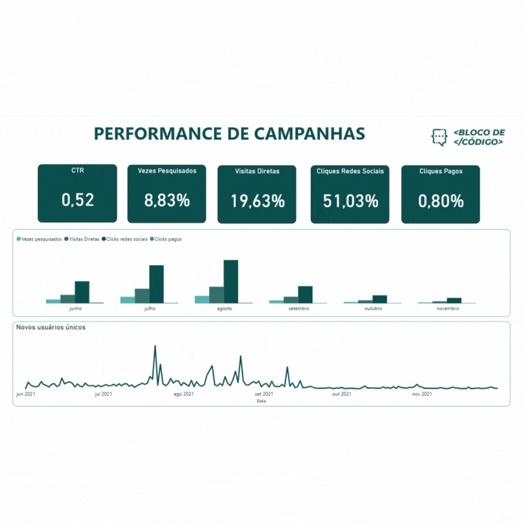
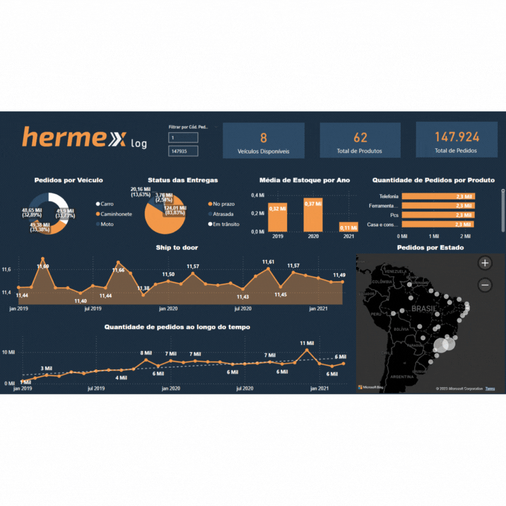

# Challenge de BI 3ª edição - Alura

O Challenge da Alura é o momento de aplicar tudo que tem aprendido nos cursos de uma área específica da plataforma. Eles procuram simular o dia a dia nas empresas e foram criados para atender a demanda de unir a teoria de nossos cursos com a prática do mercado de trabalho.

Então, durante 4 semanas vamos desenvolver um projeto que irá simular a rotina de trabalho. Esse projeto vai ser dividido em desafios com diferentes níveis de complexidade.

## 1ª Semana - Campanha de Marketing

Nesse primeira semana, fomos contratado pelo blog **Bloco de Código**, para analisar as campanhas de marketing que fizeram para divulgar o blog. O blog conta com vários artigos para a área de tecnologia, como dados, marketing, experiência do usuário e vários outros assuntos.  O dashboard foi desenvolvido no Power BI e nele encontramos as seguintes questões:

* Valor do CTR (Click Through Rate);
* Percentual de cliques que foi obtido direto das redes socias;
* Percentual de vezes pesquisados, que é o percentual de quantas vezes o artigo foi buscado nos mecanismos de pesquisas;
* O percentual de cliques pagos em relação ao total de visualizações que um conteúdo recebeu;
* O percentual de visitas diretas é a relação entre o visitas diretas que um conteúdo recebeu ao o número de total de visualização;
* A quantidade de novos usuários do blog captados pela campanha de marketing.

O resultado do desenvolvimento do dashboard pode ser visualizado abaixo:

## 2ª Semana - Logística 

Nessa semana, fomos contratado pela empresa **Hermex**, para analisar os dados sobre a logística das entregas do seu negócio do périodo de 2019 até 2021. O dashboard foi desenvolvido no Power BI, com o objetivo principal de compreender melhor a distribuição de pedidos em todo território nacional, entender KPIs como Ship to Door, além de acompanhar o estoque e veículos disponíveis. No dashboard encontramos as seguintes questões:

* Status das Entregas (Pedidos entregues no prazo, fora do prazo e em trânsito);
* Número de veículos disponíveis para entrega;
* Cálculo do "Ship to door", que é o tempo da expedição até a chegada do produto para o cliente;
* A quantidade de pedidos por estado;
* Nível médio de estoque disponível por ano.

O resultado do desenvolvimento do dashboard pode ser visualizado abaixo:

## 3ª e 4ª Semana - Financeiro

Nessas 2 últimas semanas, fomos contratado pela empresa **Meteora**, pois ela precisa entender como está o desempenho de suas vendas.

Para dar início nas análises será necessario a princípio restaurar o banco de dados MySQL com arquivo de dump disponibilizado pela empresa. Atualmente estamos trabalahando nisso.

