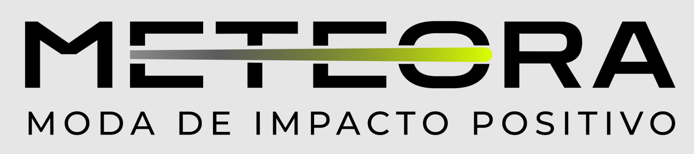
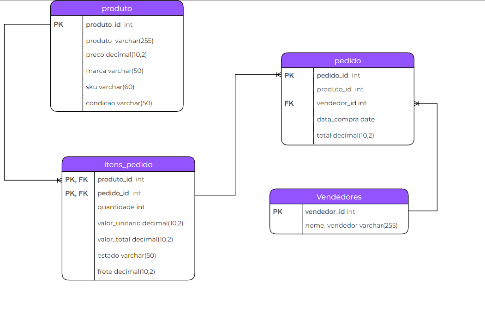
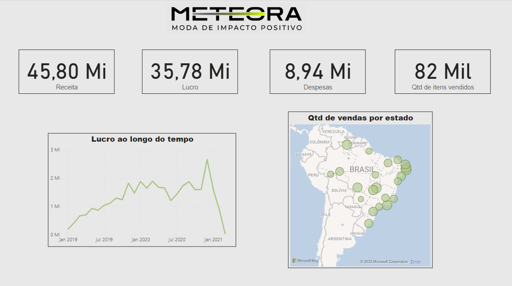

# Challenge de BI 3ª edição - Alura

Esse é um projeto desenvolvido por mim durante o Challenge de BI 3ª Edição promovido pela Alura, uma plataforma online de cursos de tecnologia. A ideia do Challenge é simular uma experiência de trabalho.
Nesse Challenge desenvolvemos 3 projetos com diferentes níveis de complexidade.

## 1ª Projeto - Campanha de Marketing

Fomos contratado pelo blog **Bloco de Código**, para analisar as campanhas de marketing que fizeram para divulgar o blog. O blog conta com vários artigos para a área de tecnologia, como dados, marketing, experiência do usuário e vários outros assuntos.  O dashboard foi desenvolvido no Power BI e nele encontramos as seguintes questões:

* Valor do CTR (Click Through Rate);
* Percentual de cliques que foi obtido direto das redes socias;
* Percentual de vezes pesquisados, que é o percentual de quantas vezes o artigo foi buscado nos mecanismos de pesquisas;
* O percentual de cliques pagos em relação ao total de visualizações que um conteúdo recebeu;
* O percentual de visitas diretas é a relação entre o visitas diretas que um conteúdo recebeu ao o número de total de visualização;
* A quantidade de novos usuários do blog captados pela campanha de marketing.

O resultado do desenvolvimento do dashboard pode ser visualizado abaixo:

Para mais detalhes veja o arquivo [bloco_de_notas.pbix](bloco_de_notas.pbix).

## 2ª Projeto - Logística 

Fomos contratado pela empresa **Hermex**, para analisar os dados sobre a logística das entregas do seu negócio do périodo de 2019 até 2021. O dashboard foi desenvolvido no Power BI, com o objetivo principal de compreender melhor a distribuição de pedidos em todo território nacional, entender KPIs como Ship to Door, além de acompanhar o estoque e veículos disponíveis. No dashboard encontramos as seguintes questões:

* Status das Entregas (Pedidos entregues no prazo, fora do prazo e em trânsito);
* Número de veículos disponíveis para entrega;
* Cálculo do "Ship to door", que é o tempo da expedição até a chegada do produto para o cliente;
* A quantidade de pedidos por estado;
* Nível médio de estoque disponível por ano.

O resultado do desenvolvimento do dashboard pode ser visualizado abaixo:

Para mais detalhes veja o arquivo [hermex.pbix](hermex.pbix).

## 3ª Projeto - Financeiro

Vamos analisar dados financeiros da Meteora, um e-commerce especializado na venda de roupas. Ela  precisa entender como anda a sua área de vendas e com base em hipóteses, analisar possíveis mudanças de cenário.

### 1 - Criação do Banco de Dados da empresa Meteora

#### Modelagem do banco de dados

#### Criação do banco de dados

A METEORA já possui seus dados armazenados em planilha de Excel, como pode ser visto no arquivo [Meteora-matriz](dados/dados_semana3/Meteora-matriz.xlsx). Com isso Fiz o download de cada tabela (produtos, pedidos, itens_pedidos e vendedores) no formato .CSV para logo em seguida enseri-las no banco de dados que vamos criar.

Para criar o banco de dados da Meteora usamos o MySQL. O script para criar o banco e as tabelas do banco pode ser visto em [database_meteora](database_meteora.sql)

### 2 - Criação do Dashboard

Para a construção do dashboard conectamos o banco de dados criado no MySQL com o Power BI. Essa conecção so foi possivel pois instalamos um conector que pode ser encontrado no site https://dev.mysql.com/downloads/connector/net/.

No dashboard encontramos as seguintes questões:

* O valor da Receita da Meteora;
* O lucro total e ao longo do tempo;
* As despesas;
* A quantidade de itens vendidos;
* A quantidade de vendas por estado.

O resultado do desenvolvimento do dashboard pode ser visualizado abaixo:

Para mais detalhes veja o arquivo [meteora.pbix](meteora.pbix).
